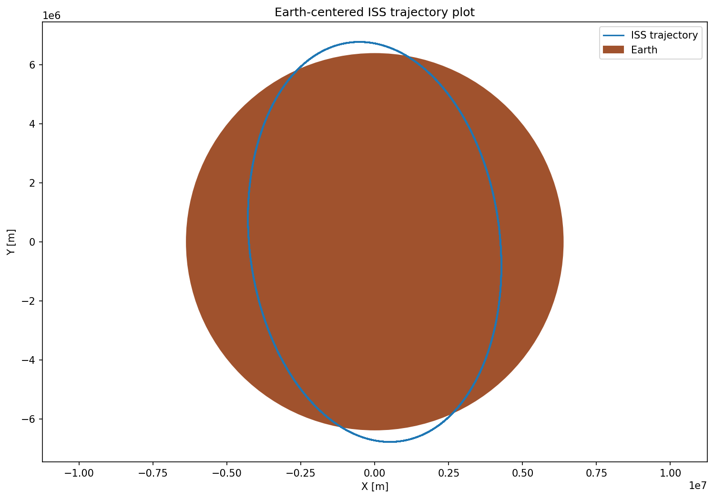
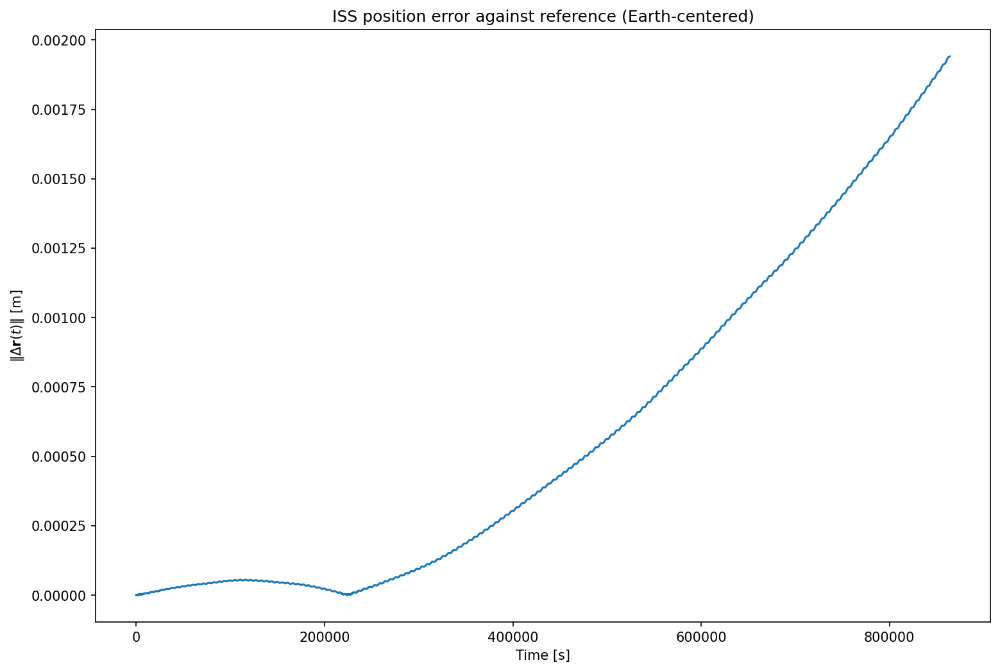
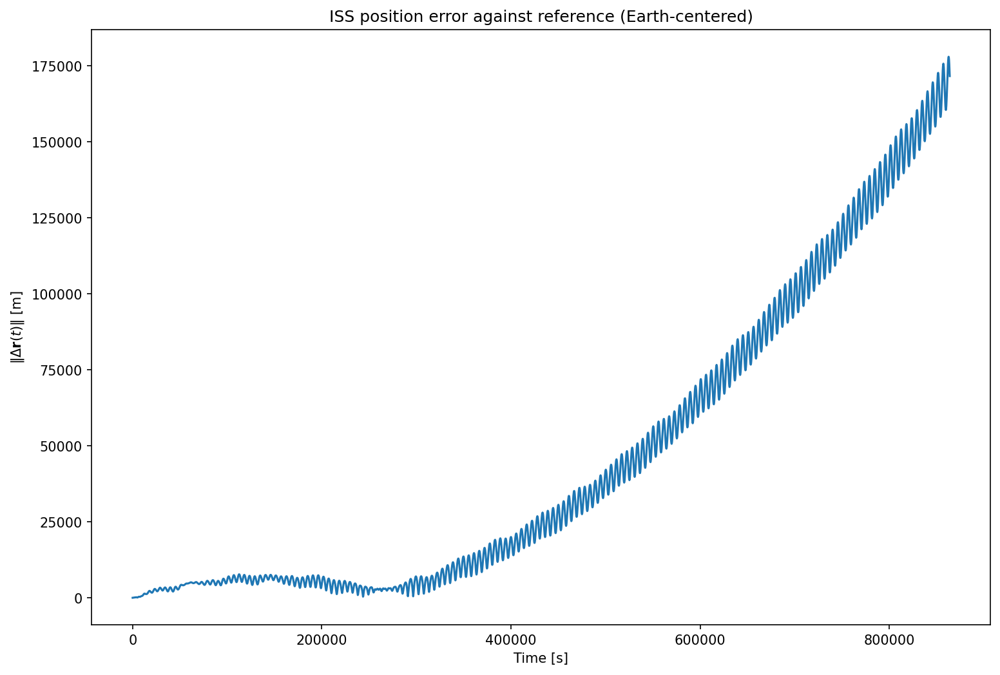
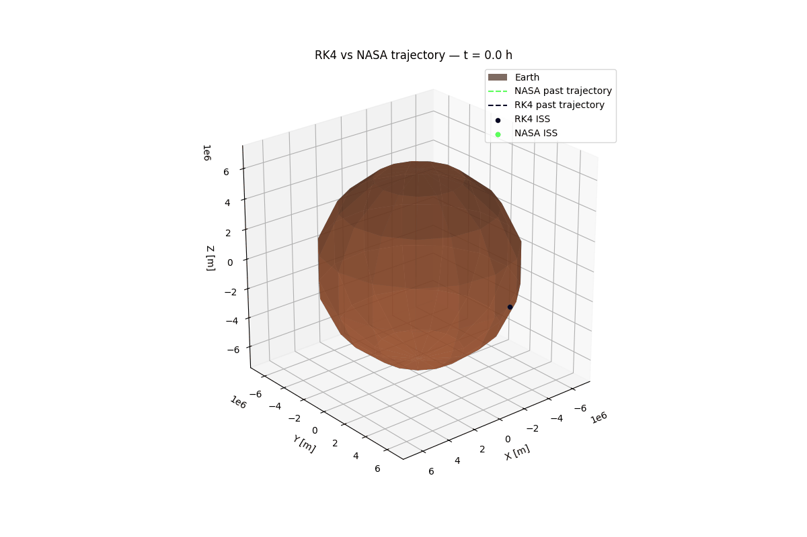

# orbital-sim

## Overview

`orbital-sim` is a numerical simulation of the Earth–ISS system developed as a Python course project.

The project models the motion of both bodies under mutual gravitational interaction. A custom fixed-step RK4 integrator implemented in C is used to propagate the system state and is accessed from Python through CFFI.

The numerical implementation is validated against SciPy's `DOP853` solver. The simulated ISS trajectory is also compared with NASA ISS OEM ephemeris data over a 10-day interval.



## Physical model

The system is represented by a 12-element state vector:

```text
[x_E, y_E, z_E, vx_E, vy_E, vz_E,
 x_ISS, y_ISS, z_ISS, vx_ISS, vy_ISS, vz_ISS]
```

The initial Earth position and velocity are set to zero, while the initial ISS state is taken from NASA OEM data.

Both bodies are propagated during the simulation. Their accelerations are calculated from Newtonian mutual gravitational interaction, so the model represents a full two-body system rather than keeping the Earth permanently fixed at the origin.

An optional Earth `J2` perturbation is also implemented to account for the dominant effect of Earth's oblateness on the ISS trajectory.

## Numerical methods

The equations of motion are written as a first-order system of ordinary differential equations.

Two numerical integrators are used:

* a custom fixed-step fourth-order Runge–Kutta method (`RK4`) implemented in C,
* SciPy's adaptive `DOP853` method used as a numerical reference.

The custom RK4 trajectory is compared with the DOP853 solution for the same physical model. This comparison is used to evaluate the numerical agreement of the custom integrator independently of the comparison with real orbital data.



## C implementation and CFFI

The RK4 algorithm is implemented in C.

The C implementation separates the integration algorithm from the function calculating the state derivative. The two-body dynamics model is passed to the RK4 integrator through a C function pointer.

Python communicates with the compiled C library using `cffi`. NumPy arrays are passed directly to C as buffers, while the calculated time history and trajectory are returned to Python for further analysis, storage and visualization.

The resulting execution path is:

```text
Python
  |
  | CFFI
  v
C two-body wrapper
  |
  v
C RK4 integrator
  |
  v
C dynamics function
```

## NASA OEM comparison

NASA ISS OEM ephemeris data is downloaded and parsed by the program.

The first OEM state is used as the initial ISS position and velocity. The remaining OEM states provide an external trajectory reference for comparison with the propagated trajectory.

This comparison is different from the RK4–DOP853 validation. DOP853 solves the same mathematical model and therefore provides a numerical reference, while the NASA OEM trajectory represents the motion of the real ISS and contains effects that are not included in the simplified simulation model.

The project compares two variants:

* Newtonian two-body gravity,
* Newtonian two-body gravity with the `J2` correction.

Adding `J2` reduces the discrepancy between the simplified model and the NASA trajectory for the analyzed interval, but does not reproduce the OEM trajectory exactly.





## Data storage

Generated simulation results are stored in an HDF5 file.

The current file structure is:

```text
data.hdf5
├── rk4
│   ├── time
│   └── trajectory
├── reference
│   ├── time
│   └── trajectory
├── rk4_J2
│   ├── time
│   └── trajectory
├── reference_J2
│   ├── time
│   └── trajectory
└── nasa
    ├── time
    └── trajectory
```

Each group contains:

* `time` — simulation or reference timestamps,
* `trajectory` — the corresponding state vectors.

This allows generated data to be reused without repeating the complete numerical simulation.

## Installation

Clone the repository and install the required Python dependencies.

```bash
git clone <repository-url>
cd orbital-sim
uv sync
```

Alternatively, the project can be installed without `uv`:

```bash
python3 -m venv .venv
source .venv/bin/activate
python -m pip install .
```

The project requires Python and the libraries used for numerical computation, visualization, HDF5 storage, HTTP communication and CFFI integration.

## Building the C library

The RK4 implementation must be compiled before running the Python simulation.

```bash
cmake -S c_rk4 -B build
cmake --build build
```

The resulting shared library is loaded by the Python CFFI interface.

## Running the project

To generate a new dataset using `uv`:

```bash
uv run orbital-sim --generate
```

If the project was installed without `uv`, run:

```bash
orbital-sim --generate
```

To reuse the existing dataset without running the simulation again:
```bash
uv run orbital-sim
```
or, without `uv`:

```bash
orbital-sim
```
The program loads the data from `data.hdf5`, produces trajectory visualizations, compares the numerical solution with the reference integration and NASA OEM data, and reports position and velocity errors.

## Validation

The project uses two complementary forms of validation.

### Numerical validation

The custom C RK4 implementation is compared against SciPy's `DOP853` integrator using the same initial conditions and the same physical model.

The resulting position and velocity differences are used to verify that the custom numerical integrator produces results consistent with the reference solver.

### External trajectory comparison

The propagated ISS trajectory is also compared against NASA OEM ephemeris data.

This comparison evaluates the combined effect of the numerical method and the simplified physical model. It therefore should not be interpreted as a pure measurement of RK4 integration error.

The effect of the `J2` correction is evaluated by comparing the final position and velocity errors of simulations with and without `J2`.

## Limitations

The simulation intentionally uses a simplified orbital dynamics model.

The current implementation includes:

* Newtonian two-body gravity,
* the optional Earth `J2` perturbation.

It does not model several effects relevant to high-accuracy ISS orbit propagation, including atmospheric drag and additional perturbations.

The RK4 integrator also uses a fixed time step, while the DOP853 reference solver uses adaptive step-size control.

For these reasons, the simulated trajectory is not expected to reproduce the NASA OEM ephemeris exactly. The NASA data is used as an external reference for evaluating the behavior and limitations of the implemented model rather than as an exact solution of the same equations.
